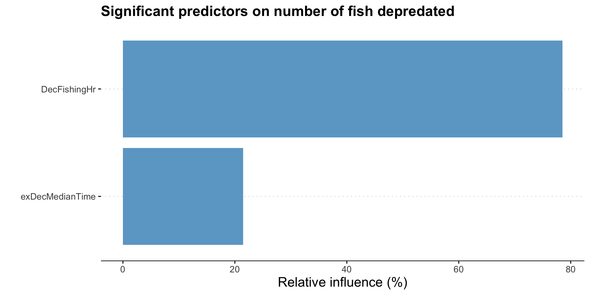
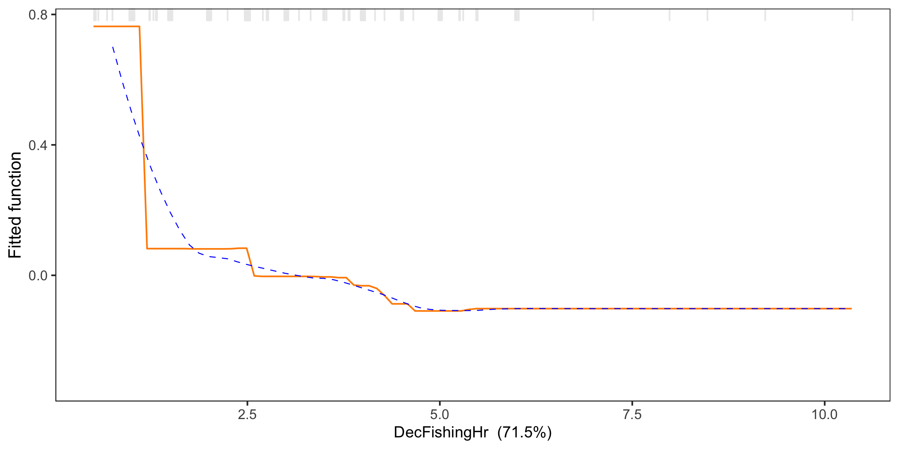

```{r setup, include = FALSE}
# knitr options
knitr::opts_chunk$set(warning = FALSE, message = FALSE, echo = FALSE, cache = TRUE, fig.align = 'center', fig.width=10, fig.height=7) 

# libraries
library(tidyverse)
library(sp)
library(raster)
library(ggplot2)
library(rgeos)
library(rgdal)
library(sf)
library(RColorBrewer)
library(ggspatial)
library(spatstat)
library(patchwork)

# directories
w.dir <- "/Users/23088313/Documents/git_repos/Analysis-Hamre-Bioeconomic"
d.dir <- paste(w.dir, "Ningaloo_RUM/rumIgnore", sep='/')
s.dir <- paste(w.dir, "spIgnore/gpkg", sep='/')
r.dir <- paste(w.dir, "spIgnore/raster", sep='/')
f.dir <- paste(w.dir, "Ningaloo_RUM/rumFunc", sep = '/')
rumExplore_plots <- paste(w.dir, "Ningaloo_RUM/rumExplore_plots", sep='/')
crExplore_plots <- paste(w.dir, "Ningaloo_RUM/rumCR/crExplore_plots", sep='/')
dpExplore_plots <- paste(w.dir, "Ningaloo_RUM/rumDP/dpExplore_plots", sep='/')
dpplot <- paste(w.dir, "Ningaloo_RUM/rumDP/models/dpBRT", sep = '/') # model directory

# source 
source(paste(f.dir, "basemap.R", sep = '/')) # base map and spatial files

# data
dat <- readRDS(paste(d.dir, "Ning_v2.csv", sep='/'))

# spatial aata
spdat <- dat %>% 
  filter(!is.na(UseLat), !is.na(UseLong)) %>% 
  st_as_sf(coords = c("UseLong", "UseLat"), crs = 4283)

## Assign colours
col1 <- c("#81caca") # Darker teal
col2 <- c("#97c1a9") # Dark Green
col3 <- c("#cce2cb") # light teal
col4 <- c("#cce2bc") # Light green
col5 <- c("dark grey") # Grey

# plot theme
ax.title <- 14
ax.text <- 9
ax.legend <- 12
strip <- 9
a4_width <- 160
my_theme <- theme_classic() + theme(axis.text=element_text(size = ax.text),
                                    text = element_text(size = ax.text),
                                    axis.title=element_text(size = ax.title),
                                    line = element_line(size = 0.3),
                                    strip.background = element_rect(colour = "white", fill = col3),
                                    strip.text = element_text(size = strip),
                                    legend.title = element_text(size = ax.legend),
                                    legend.text = element_text(size = ax.legend),
                                    plot.title = element_text(size = ax.title, hjust = 0.5))

map_theme <- my_theme + theme(axis.text.x = element_text(angle = 90))
```

```{r child = c('rumExplore.Rmd')}
```

```{r child = c('rumCR/01_crExplore.Rmd')}
```

```{r child = c('rumDP/01_dpExplore.Rmd')}
```

# depredation brt model outputs\n
Demersal only\n
    - learning.rate = 0.001
    - tree.complexity = 4
    - bag.fraction = 0.75
    - number.of.trees = 3100
    - res.dev = 0.1289609
    - discrimination = 0
  
  
  
  